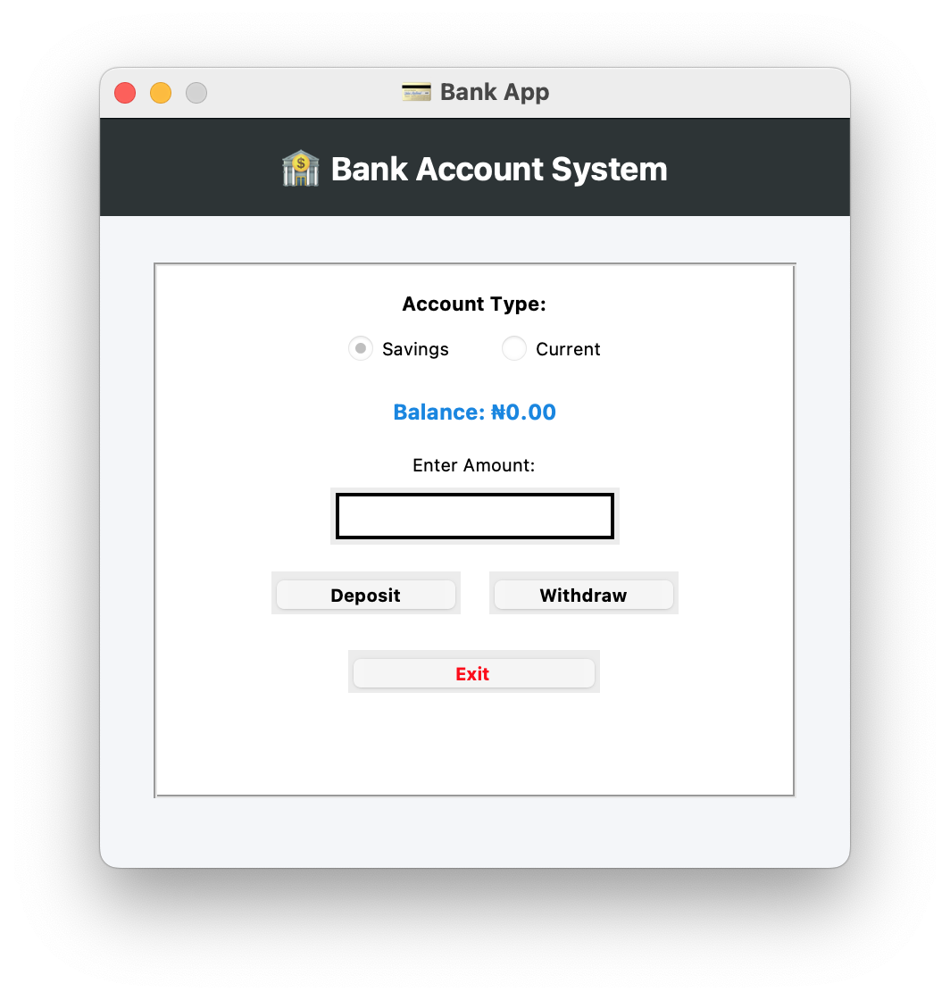

<h2> 🏦 Bank Application</h2>

 This bank application showcases the OOP paradigms which are <b>Encapsulation</b>, <b>Abstraction</b>, <b>Inheritance</b>, and <b>Polymorphism</b>. 

## Student Details

NAME: NDUNCHE JOSEPH CHIZARAM

APPLICATION NUMBER: PG202441009709 

Course Code: CSC 825

## Screenshot

  

## Features
- Deposit and Withdraw Money
- View Balance
- Switch Between Account Types

